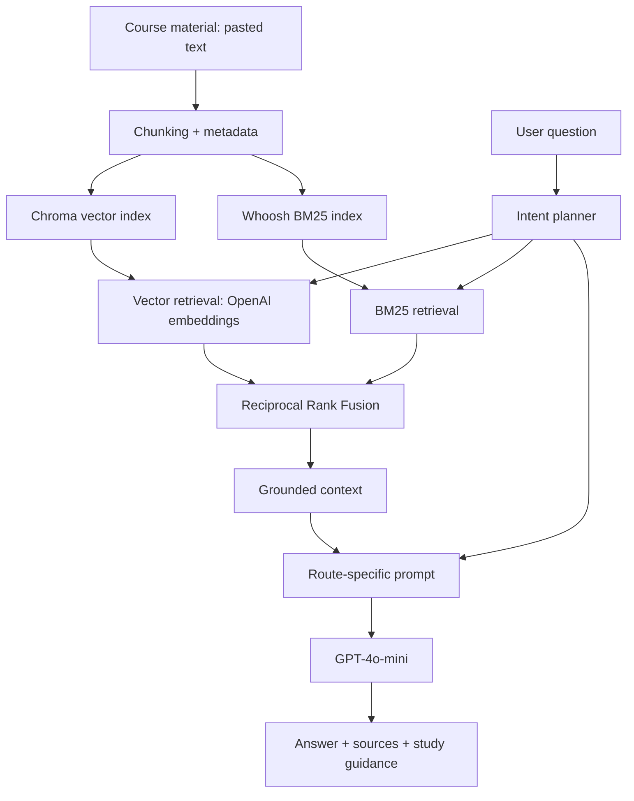

# Recall

Recall is an AI study assistant grounded in personal course material. It ingests study notes, retrieves relevant evidence using hybrid search, routes questions by learning intent, and generates grounded answers with source references.

**FastAPI ? React / TypeScript / Vite ? OpenAI ? ChromaDB ? Whoosh BM25 ? RRF**

## What Recall does

- **Build a study library:** ingest pasted course notes, split them into overlapping chunks, and index them with document IDs, chunk IDs, and course metadata.
- **Search meaning and terminology:** combine Chroma vector retrieval with Whoosh BM25 using Reciprocal Rank Fusion (RRF).
- **Adapt to learning intent:** a planner selects concept explanation, source recall, exam preparation, or a general answer route.
- **Generate source-backed study answers:** route-specific prompts request explanations, revision priorities, and citations; responses include source passages and study hints.
- **Provide a React interface:** add notes, ask questions, inspect source references, and browse/search document previews.
- **Measure retrieval quality:** versioned benchmarks, deterministic metrics, shared-pool reranker ablations, and saved experiment reports.

Prompts request grounded answers and ?I don't know? when evidence is insufficient; generation and refusal quality remain untested.

## Architecture



Routes select prompt style, not different retrievers. Routed `/ask` uses the first three hybrid retrieval results; fallback generation retains the lexical heuristic reranker. MiniLM remains evaluation-only.

## Why Recall is more than a basic RAG chatbot

Dense + sparse retrieval finds evidence; intent-aware orchestration adapts answer structure to the study task. Grounded generation connects answers to passages, and empirical evaluation tests whether retrieval complexity helps.

## Retrieval Evaluation ? Milestone 1

**19 manually curated questions: 16 answerable, 3 unanswerable.** Experiments compare vector, BM25, hybrid/RRF, heuristic, and MiniLM CrossEncoder reranking. Evidence groups accept equivalent chunks; complete coverage requires all answer components.

Evidence scores compare orderings of the **same hybrid pool**, averaged over 16 answerable cases:

| Ordering | Evidence MRR | Complete coverage@3 |
|---|---:|---:|
| Hybrid / RRF | **0.96875** | 0.93750 |
| MiniLM CrossEncoder | 0.95833 | **1.00000** |
| Heuristic reranker | 0.93750 | 0.93750 |

Among the evaluated hybrid orderings, plain Vector + BM25 + RRF remains the preferred evaluation baseline because it offers the best current quality / simplicity / latency trade-off on this benchmark. The earlier canonical four-mode benchmark favored vector-only, so no universal superiority claim is made.

## Key engineering findings

- **Evaluation exposed a BM25 natural-language parsing bug:** free-text questions were interpreted as query syntax. The fix analyzes input and searches literal terms.
- **Heuristic reranking degraded ranking quality:** canonical-rank ablation found 0 improved, 10 unchanged, and 6 worsened answerable cases.
- **MiniLM performed better than the heuristic**, but did not clearly outperform plain RRF and added about **0.65 s CPU reranking latency** per query in the experiment. It remains evaluation-only.
- **Evidence groups corrected exact-UUID scoring artifacts:** overlapping chunks can contain equivalent evidence, so requiring one arbitrary UUID can misrepresent retrieval quality.

## Screenshots / demo

*Product screenshots and a short demo will be added here.* The current interface includes note ingestion, question answering with source inspection, and a searchable library.

## Tech stack

| Area | Technologies |
|---|---|
| Backend | Python, FastAPI, Pydantic |
| Retrieval / AI | OpenAI `text-embedding-3-small`, ChromaDB, Whoosh BM25, RRF, GPT-4o-mini |
| Frontend | React, TypeScript, Vite, Tailwind CSS, Framer Motion |
| Evaluation | Standard-library unittest, JSON benchmarks, deterministic metrics; optional sentence-transformers / Transformers / PyTorch |

## Run locally

Python 3.12 / Node.js 22. Run backend commands from the repository root. Ingestion and questions require an OpenAI API key and incur usage costs.

```sh
python -m venv .venv
```

Activate with `.venv\Scripts\Activate.ps1` on PowerShell, or `source .venv/bin/activate` on macOS/Linux. Then:

```sh
python -m pip install -r requirements.txt
```

Copy `.env.example` to `.env` and replace the placeholder locally. Start the API:

```sh
python -m uvicorn app.api.main:app --reload
```

API: `http://127.0.0.1:8000` ? interactive docs: `http://127.0.0.1:8000/docs`

In a second terminal:

```sh
cd recall-frontend
npm ci
npm run dev
```

Open Vite's URL (normally `http://localhost:5173`). Ingest **text**, not PDFs. Endpoints: `POST /ask`, `POST /ingest`, `GET /documents`. This is a local development project without authentication or deployment configuration.

## Evaluation / reproducibility

Tests and saved-result verification require no API calls or model downloads:

```sh
python -m unittest discover -s tests
python -m evaluation.validate_benchmark
python -m evaluation.verify_saved_results
```

- [Milestone 1 methodology and results](evaluation/MILESTONE_1_RETRIEVAL_EVALUATION.md)
- [Evaluation commands, setup, and saved artifacts](evaluation/README.md)

Semantic reranking dependencies are optional and separate from core requirements; see [optional semantic setup](evaluation/README.md#optional-semantic-reranking).

Saved scores reproduce offline; identical live reruns require historical local indexes, which are not versioned. Re-ingestion changes UUIDs. Scope: 27 Chroma chunks / 12 documents; Whoosh has one extra chunk and the catalog is stale. Latency is experimental, not a production benchmark.

## Repository structure

| Path | Purpose |
|---|---|
| `app/` | Ingestion, retrieval, intent planning, generation, and API |
| `recall-frontend/` | React application and frontend lockfile |
| `evaluation/` | Benchmarks v1/v2, metrics, experiments, and saved results |
| `tests/` | Unit tests; semantic scorers are mocked |
| `docs/milestone1/` | Traceable public results and presentation sources |

## Roadmap

- **Milestone 1 ? Retrieval evaluation:** complete.
- **Milestone 2 ? Generation quality, groundedness, hallucination, and refusal evaluation:** planned.
