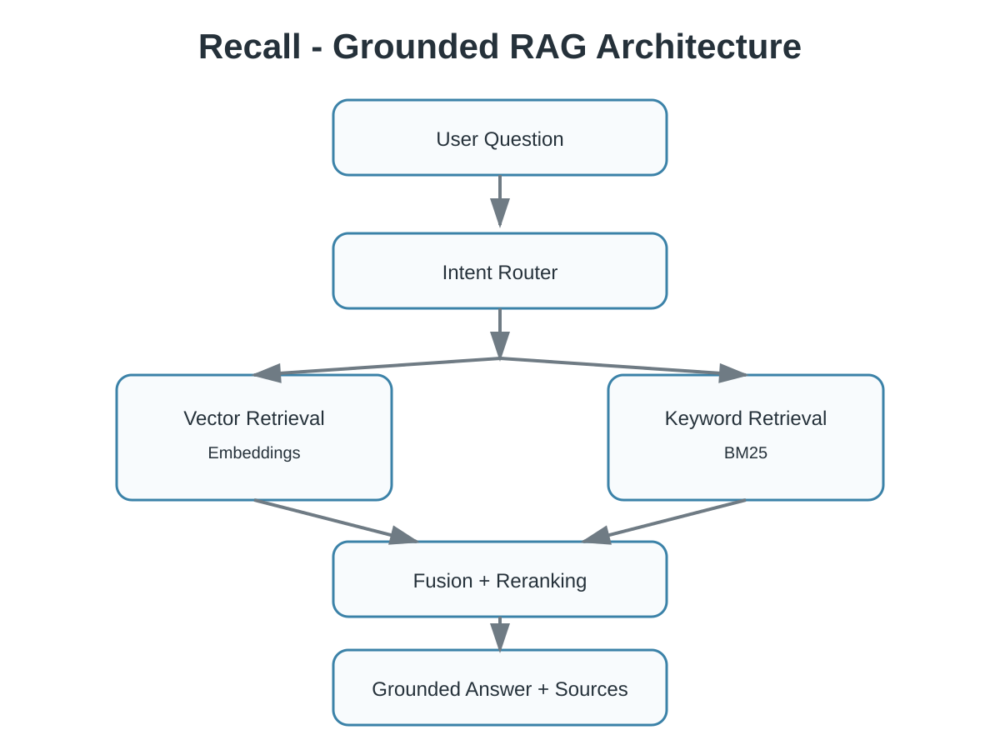

<div align="center">

# 🧠 Recall

### A grounded AI study assistant powered by Retrieval-Augmented Generation

Recall helps students understand, revise, and retrieve knowledge from their own learning materials using **hybrid retrieval**, **LLM reasoning**, and **source attribution**.

<br>


</div>

---

## 📚 Why Recall?

Learning material is often scattered across lectures, PDFs, and personal notes. Recall transforms these sources into a searchable knowledge base and generates answers grounded in the original material.

The system follows a retrieval-first approach:

1. Retrieve relevant knowledge
2. Generate answers from retrieved evidence
3. Provide supporting sources

---

## ✨ Core Capabilities

| Capability | Description |
|---|---|
| 🎯 Intent routing | Adapts responses to explanation, retrieval, and revision tasks |
| 🔎 Hybrid retrieval | Combines vector search and BM25 keyword retrieval |
| 🔗 Source attribution | Connects answers back to supporting documents |
| 🧠 Grounded generation | Uses retrieved context to improve reliability |
| 📊 Retrieval debugging | Provides visibility into retrieval decisions |

---

## 🎬 Product Preview

Recall provides three main workflows:

| Feature | Purpose |
|---|---|
| Ask | Explain concepts from personal notes |
| Add Notes | Build a personal knowledge base |
| Library | Explore indexed sources |

---

## 🏗 Architecture

<p align="center">

</p>

Recall uses a retrieval-first RAG pipeline:

```
User Question
      |
Intent Routing
      |
Hybrid Retrieval
(Vector Search + BM25)
      |
Fusion + Reranking
      |
Grounded LLM Generation
      |
Answer + Source Attribution
```

---

## 🔍 Retrieval Pipeline

### Hybrid Retrieval

Recall combines:

- semantic retrieval using embeddings
- keyword retrieval using BM25

Results are merged and ranked before being passed to the generation layer.

### Grounded Generation

Responses are generated from retrieved evidence and remain connected to the original documents.

---

## 💡 Engineering Decisions

### Why hybrid retrieval?

Semantic search captures meaning while keyword retrieval preserves exact terminology.

### Why source attribution?

Generated answers should remain verifiable by exposing the supporting evidence.

---

## 📈 Evaluation

Current evaluation focuses on:

- intent routing
- source attribution
- retrieval inspection
- answer grounding

Future improvements include retrieval benchmarks and automated quality evaluation.

---

## 🛠 Technology Stack

**AI / Retrieval**

- LLM API
- Embeddings
- ChromaDB
- Whoosh BM25
- Reciprocal Rank Fusion

**Backend**

- Python
- FastAPI
- Pydantic

**Frontend**

- React
- TypeScript
- Vite
- Tailwind CSS

---

## 🚀 Quick Start

```bash
git clone https://github.com/nour0205/Recall.git
cd Recall
python -m venv .venv
pip install -r requirements.txt
```

Run the backend:

```bash
python -m uvicorn app.api.main:app --reload
```

Run the frontend:

```bash
cd recall-frontend
npm install
npm run dev
```

---

## 🚧 Roadmap

- [ ] Retrieval benchmark
- [ ] Improved reranking
- [ ] PDF/DOCX ingestion
- [ ] Automated evaluation pipeline
- [ ] Docker deployment

---

## 🌱 Motivation

> The problem was not forgetting concepts. It was forgetting where you learned them.

Recall explores how retrieval-based AI systems can make generated answers more useful, transparent, and trustworthy.
